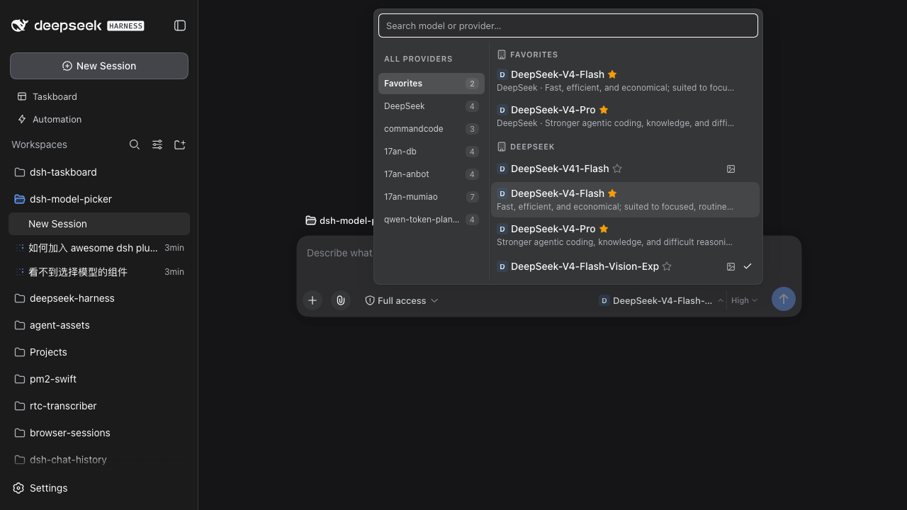

[English](README.md) | [简体中文](README.zh-CN.md)

# dsh-model-picker

Enhanced model picker for the dsh web GUI — replaces the composer's model seat
(`conversation.input.model`).

## Design

A **two-zone trigger button** splits model selection and reasoning-effort
selection into separate popups:

| Zone | Click | Popup content |
|------|-------|---------------|
| **Left** (model name) | Opens the model picker | Search box at top (auto-focused), provider column on the left, model list on the right |
| **Right** (effort) | Opens the effort picker | List of available reasoning-effort levels |

Hovering a zone names what it will act on. The model zone reads
`provider · model`: one model id is routinely served by several providers, so
the name alone does not say where the model runs. The supplier named is the
**display** one, so a selection on a folded `(modlens vision)` route still reads
as its base provider — the same name the user clicked in the column.

## Supplier chip

The supplier's leading character rides ahead of the model name — `D` for
DeepSeek, `智` for 智谱 GLM — on the **closed trigger** as well as on every row in
the list, so a model's source is legible before the picker is ever opened.

- The trigger's `max-width` grows by the chip's footprint (16px + its gap), so
  wearing the chip costs the model name no characters.
- The chip names the **display** supplier, so a row served by a folded
  `(modlens vision)` route wears its base provider's chip rather than one of its
  own.
- Each supplier also gets a fixed tint derived from its route id. Without it
  `17an-db`, `17an-anbot` and `17an-mumiao` would all show a bare `1` and read as
  one supplier. Only the background carries the hue, so the glyph itself stays
  legible in either theme.

## Provider folding

A provider whose name is another provider's name plus a trailing parenthesized
capability suffix folds into that base provider's row. modlens registers vision
as its own provider route (`DeepSeek (modlens vision)`), which would otherwise
put a near-duplicate row per provider in the column.

- Folding is **display-only**: every row keeps its models paired with the group
  that serves them, so picking a folded model still submits that model's own
  provider id.
- The suffix stays on the model name, and a folded model whose route differs
  from its row is labelled with that route, so the two are never confused.
- A suffixed provider whose base is absent keeps its own row.

## Model facts (context window / image input)

The browser catalog the seat reads (`ModelCatalogModel`) carries only
`id / name / description / reasoning` — **no** context window and **no** input
modalities. Both exist on the Host's `llm` service, so the host half
(`lib/host.js`) republishes them over one loopback route:

```
GET /api/model-picker/models
→ { ok: true, models: [{ provider, id, contextWindow?, input? }] }
```

- `resolveModel()` is the only source of `context: { contextWindow }`;
  `listModels()` is the cheaper source of `inputModalities`.
- One row per provider/model is isolated: a provider or model that throws is
  dropped, and a row carrying neither fact is omitted entirely.
- The snapshot is cached for 30s — the route never fans out per keystroke.
- The popup badges each row with a context chip (`1M`, `384K`) and an image
  glyph, joined on `provider/modelId`.
- **Vision.** A full-strength glyph means the model reads pixels itself. A
  dimmed glyph means the route accepts images only because modlens bridges
  them: the model still cannot see — modlens transcribes the image to text
  first. The `(modlens vision)` suffix is what tells the two apart.
- The modlens suffix is *not* the general vision signal: modlens declines to
  wrap a model whose id already carries a vision marker, whose catalog
  declares image input, or that falls outside its configured families. A row
  with no suffix can therefore be natively vision-capable; the glyph, not the
  name, is the answer. With modlens disabled the folding and the bridge glyph
  are simply dormant — nothing is suffixed.
- Before the host half has been restarted the route 404s, so the context chip
  and native-vision glyph are missing until then.

## Grouped list (elevator)

The right column is always one grouped list: **Favorites** (`收藏` in a Chinese UI — the starred models, a mirrored copy at the top), then every provider's group. The left column is a table of contents to this list.

- Scrolling the right column highlights the left row for the section pinned at the list's top edge (scroll spy / elevator). The group headers are `position: sticky`, so the left row always matches the header you see.
- Clicking a left-column supplier scrolls the list to that group. During a search, clicking a supplier **narrows** the results instead (search facet).

## Favorites

Every model row carries a `☆` / `★` toggle between the name and the fact strip. The row is itself a `<button>`, so the star stops its click from reaching it — favoriting a model must never also pick it — and it handles `Enter` / `Space` on its own.

- Favorited models appear **twice** in the list: once in their provider's group, and once in the favorites group pinned at the top of the list. A favorites row always names the provider serving it.
- Favorites are keyed on the **route** (`provider/modelId`), not the bare model id: one model id is routinely served by several configured providers, and favoriting one route says nothing about the others.
- They live in `localStorage` under `dsh.modelPicker.favorites`, the same place the shipped conversation plugin keeps its own view and width preferences. A storage refusal (private mode, full quota) is swallowed: the in-memory set still tracks the page.

## Search semantics

The query is a facet over **both** columns, not just the model list:

- A provider matches by its display name, its route id, or by having at least one matching model. The provider column narrows to the matching providers and each badge shows that provider's match count.
- With no provider selected, the model list spans every matching provider and labels each row with its provider.
- Clicking a provider during a search narrows the list to that provider without clearing the query. Typing a new query clears the previous provider facet.

Model and effort data ride the same per-session `ModelDirectory` as the `/model`
popup, so a switch in either surface is what the other shows next.

## Test

`npm test` runs both halves:

- `scripts/interaction.mjs` drives the browser half in jsdom through its real
  loader entry: opens the model popup, types provider and model names, asserts
  that both columns filter, that a provider facet keeps the query, and that the
  fact badges land on the rows the fact route describes. The fake context
  enforces cordis's `without inject` rule, so a missing service declaration
  fails the test instead of the live seat. It also asserts every icon is an
  **SVG**, never a text emoji or symbol character, in the closed trigger and in
  both popups.
- `scripts/host-route.mjs` drives the real route handler with a stub `llm`:
  asserts the row shape, that a throwing provider/model is isolated, and that
  the 30s cache answers without re-listing.

**Icon alignment.** An inline `<svg>` sits on the text baseline, so the font's
descender space below it lifts the glyph above the centre of its own line box —
which is what knocks a chevron or a check mark off the text's horizontal line.
`.dsh-mp2-root svg{display:block}` removes that space, and each icon wrapper
centres its contents, so an icon's centre lands on the text's centre line.

`node scripts/probe.mjs` checks the real thing: it opens the running GUI
(`DSH_COOKIE_JAR`, default `/tmp/dsh-cj.txt`, holds an authenticated session
cookie), asserts the component mounted into the seat, opens the popup, measures
that the panel does not resize while the query narrows, and writes
`live-model-picker.png`.

`node scripts/screenshot.mjs` regenerates the README image. It stars two models
from different suppliers first — the favorites group is the feature a still image
has to show, and it is empty on a fresh browser profile — and refuses to write a
shot whose favorites group came out empty. Override the output with `SHOT_OUT`.

## Slot

Injects into `conversation.input.model` (declared by
`@deepseek-ai/dsh-client-ui-conversation`).

## Inject contract

The seat is a **single** slot, so this entry shadows the shipped
`ModelSelect` — a registration that crashes leaves the composer with no model
control at all. cordis rebinds a service proxy's `this.ctx` to the **caller**,
so every face of `ctx.modelDirectories` (`directoryFor`, `load`, `select`) reads
`remote.session` through *this* plugin's inject set. The declaration is
therefore:

```js
const inject = ['slots', 'sessions', 'modelDirectories', 'remote', 'remote.session']
```

Dropping `remote` / `remote.session` throws
`cannot get property "remote.session" without inject` inside the seat's inject
factory; the entry abdicates and the enhanced picker never appears.
